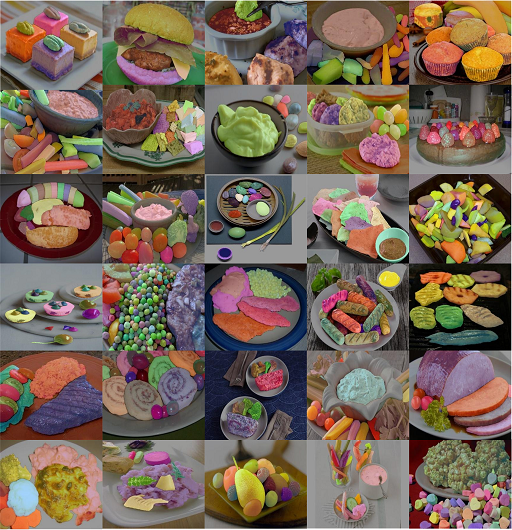

# FoodInsSeg

we build FoodInsSeg, the first ingredient-level food instance segmentation benchmark in the food segmentation field. This dataset contains a total of 7,118 food images, which have been annotated with 103 categories and 119,048 segmentation masks at ingredient level. Moreover, we also propose anovel and effective tool, named IngredientSAMTool, which leverages the Segment Anything Model and seamless manual operations to annotate the dataset.

## introduction

Following the practice of FoodSeg103，FoodInsSeg contains a total of 7,118 images with the same train and test splitting, where 4,983 images are used for training and 2,135 for testing. For each image, we provide individual masks for food items and label each item with one of the 103 food ingredient categories. The whole dataset offers 119,048 instance masks, in which there are 82,716 for training and 36,332 for testing. In the test set, there is an average of 17.01 masks per image and a maximum of 186 masks in a single image. Whereas in the training set, there are on average 16.59 masks per image and up to 126 masks for a single image.

For more details about FoodInsSeg, please refer to our paper and dataset homepage at the links below. 

[[`Paper`]()] 
[[`Project`](https://laura990501.github.io/FoodInsSeg_dataset/)]




## download
To download our dataset, please use the link below:

[[`google drive`](https://drive.google.com/drive/folders/19ooGlULRv1BNXS9_ZS2NdlXWewVI6ORX)]
[[`baidu netdisk`](https://pan.baidu.com/share/init?surl=Rdb8CHZclrmf5-Gy1xZQ0w&pwd=vzxj)]

To ensure responsible utilization of the dataset, researchers accessing it should adhere to the following guiding principles:

    1.The FoodInsSeg dataset is available for academic research only, commercial and any profit purposes are strictly prohibited
    
    2.Unauthorized redistribution, publication, or dissemination in any form is prohibited.
    
    3.We retain the right to terminate access at anytime. Users should voluntarily comply with the agreement.
    
    4.Please cite our work based on the BibTex information we have provided.

We sincerely hope that FoodInsSeg will contribute to the progress of computer vision and food recognition research. We kindly request that you follow the agreement and properly cite the data source in your work.
## dataset structure

Our dataset follows the format of the COCO instance segmentation dataset. It contains the original images as well as annotation files, which are split into training and test sets. Here is the dataset structure: 
````
FoodInsSeg
  -- images
     |-- train
     |   |-- 00000001.jpg
     |   |-- 00000002.jpg 
     |   |-- ...  
     |-- test
     |   |-- 00000048.jpg
     |   |-- 00000263.jpg
     |   |-- ... 
  -- annotations
     |-- Train.json
     |-- Test.json
````

The test.json and train.json annotation files contain five fields: "info", "licenses", "annotations", "images", and "categories". Specifically, the "annotations" field stores instance mask information in polygon format, including mask id, image id, polygon vertices, etc. The "images" field stores image id, width, height, image name, etc. The "categories" field stores the category id and corresponding category name for each class. For more details on the dataset format, please refer to the official COCO dataset [documentation](https://cocodataset.org/#format-data). 

The format of json files shows below:

````
{
  "info": info,
  "images": [image],
  "annotations": [annotation],
  "licenses": [],
  "categories":[category]
}

image{
  "id": int,
  "width": int,
  "height": int,
  "file_name": str
}

annotation{
  "id": int,
  "image_id": int,
  "category_id": int,
  "segmentation": [polygon],
  "area": float,
  "bbox": [x,y,width,height],
  "iscrowd": 0,
}

category{
  "id": int,
  "name": str,
}
````

## evaluate

To evaluate results on this dataset, you can save predicted masks in the [COCO results file format](https://cocodataset.org/#format-results) and then use the official [COCO API code](https://github.com/cocodataset/cocoapi/blob/master/PythonAPI/pycocotools/cocoeval.py) to evaluate results. Alternatively, you can refer to our provided [demo file](https://github.com/jamesjg/FoodInsSeg/blob/main/eval.py).

## visualization

We also provide the [visualization code](https://github.com/jamesjg/FoodInsSeg/blob/main/visualize.py) for COCO data that can conveniently display our dataset.

## cite 
